<p align="center">
  <a href="https://seekbeat.expo.app/" target="_blank" rel="noopener noreferrer">
    
  </a>
</p>

# SeekBeat-UI

Frontend for SeekBeat – a music streaming platform supporting both local library. Built with React Native for Web. Clean UI, responsive design, and offline-first behavior.

## 📑 Table of Contents

1. [Screenshots](#2-screenshots)
2. [Overview / Motivation](#3-overview--motivation)
3. [Architecture](#4-architecture-at-a-glance)
4. [Key Features](#5-key-features)
5. [Companion Backend](#6-companion-backend)
6. [Quick Start (Frontend)](#7-quick-start-frontend)
7. [Technical Highlights](#8-technical-highlights--lessons-learned)
8. [Roadmap](#9-roadmap--future-ideas)

---

## 2. Screenshots

### Desktop View

| **Dark**                                     | **Light**                                      |
| -------------------------------------------- | ---------------------------------------------- |
|          |   |
|  |  |
|      |       |

### Mobile View

| Home                                       | Settings                                           | Player                                          |
| ------------------------------------------ | -------------------------------------------------- | ----------------------------------------------- |
|   |   |   |
|  |  |  |

---

## 3. Overview / Motivation

### Problem

During a semester project, I surveyed classmates about how they discover and download music.  
Here’s what stood out:

| Pain Point               | Real User Quotes                                              |
| ------------------------ | ------------------------------------------------------------- |
| **Ads everywhere**       | “Multiple routing to different pages… and several ads.”       |
| **Hard to download**     | “It’s too complex to download the songs to my local storage.” |
| **Limited availability** | “I mostly don’t find the very music I intend looking for.”    |
| **Locked features**      | “Some songs are for premium users.”                           |

Students mostly used **YouTube, Telegram, and Mp3Juice**—and _everyone_ wished for a **simple, direct way** to search and download music.

### My Goal

Create a **clean, ad-free platform** that lets anyone:

- 🔎 **Search** for music (YouTube API)
- 🎧 **Stream** instantly
- 💾 **Download** without jumping through shady links or pop-ups
- 🌓 **Customize** the look (themes & colors) while staying responsive across devices

### Why React Native for Web

SeekBeat started as the **frontend for my Django backend**, but I chose **React Native Web** because:

- I plan to reuse the **same codebase** for a future **mobile app** and **desktop client**.
- It provides a **native-like experience** while staying web-deployable.

### What Makes It Different

- **User-hostable backend**: A packaged Django executable (SeekBeat Companion) lets anyone run the backend locally or tunnel it via ngrok.
- **Dynamic backend URL**: Users can switch between a hosted API (for search) and their own companion server—no rebuild required.

---

## 4. Architecture at a Glance

SeekBeat is built as a small, modular full-stack system designed for both local-first usage and web deployment. The goal is practical portability: a single frontend codebase (React Native for Web / Expo) that talks to a simple Django backend which can be run locally (packaged as a `.exe`) or hosted for search-only usage.

Key points:

- **Frontend:** React Native for Web (Expo), single codebase for web and future native/desktop clients. Uses built-in React Contexts for state, default stylesheet-based theming, and localStorage/session storage for persistence & splash handling.
- **Backend:** Django + Django REST Framework, `yt-dlp` for extracting stream/download URLs, `mutagen` for ID3 injection. Packaged for end users via **PyInstaller** as a self-contained `.exe` for desktop use; also optionally deployed to a host for search-only features (cookies and YouTube auth make hosted streaming unreliable).
- **Streaming:** Backend fetches direct stream URLs from YouTube or serves proxied streams for clients (supports HTTP range requests).
- **Storage & Caching:** Music is not permanently stored on the hosted server—backend can cache transiently; frontend uses local storage for metadata, caches, and session flags.
- **CI/CD & Releases:** GitHub Actions builds and publishes preview/production via EAS/Expo hosting; backend desktop builds are published as GitHub Releases (PyInstaller artifacts).

Below are two diagrams — a high-level flow and a more detailed integration map — that make the architecture concrete.

```mermaid
flowchart LR
  subgraph ClientDevices
    U["User Devices
    (Phone / Desktop / Browser)"]
  end

  Frontend["Frontend
  React Native Web (Expo)"]
  BackendHosted["Hosted Backend
  (Render) — Search only"]
  BackendLocal["Companion Backend (.exe)
  (Django + yt-dlp)"]
  YouTube["YouTube / Upstream"]
  GitHub["GitHub Releases / CI"]
  Tunnel["Ngrok / Localtunnel"]
  Storage["Local Storage / Cache"]

  U --> Frontend
  Frontend -->|REST / API| BackendHosted
  Frontend -->|REST / API| BackendLocal
  BackendLocal -->|"yt-dlp / stream"| YouTube
  BackendHosted -->|"search fallback"| YouTube
  BackendLocal --> Storage
  Frontend --> Storage
  GitHub -->|"releases"| BackendLocal
  Tunnel -.-> BackendLocal
  U -->|"optional remote access"| Tunnel

```




---

## 5. Key Features

SeekBeat is focused on giving users a clean, local-first music experience with practical editing, fast streaming, and robust UX features.

- 🎧 **Real-time streaming** — Play YouTube-based audio quickly via direct stream URLs or via the companion backend proxy for maximum compatibility. Player includes full transport controls (play/pause/seek/skip).

- ✂️ **On-the-fly editing & trimming** — Trim start/end, change playback speed and volume, and remove unwanted parts before streaming or downloading. Edits are applied server-side when producing downloadable files.

- 💿 **Server-side downloads with metadata** — Request downloadable MP3 outputs created by the backend. Files are produced on-the-fly with embedded ID3 tags and cover art using `mutagen`.

- 🎛️ **Playback shortcuts & UX parity** — Keyboard shortcuts that mimic YouTube’s playback keys (seek forward/back, play/pause, volume), giving power users a familiar control scheme.

- 🎚️ **Player queue & prefetching** — Robust queue UI for managing playback order, plus intelligent prefetching of the next track for seamless gapless-like transitions and reduced startup latency.

- 🗂️ **Download history & search history UIs** — Persistent download history (pending / in-progress / done / error states) and search history that make it easy to revisit recent activity. Frontend stores metadata locally so history survives reloads.

- 📱 **Responsive UI / Single codebase** — Built with **React Native for Web (Expo)** so a single codebase supports desktop and mobile web. Uses React Contexts and local/session storage for state and splash handling.

- 💾 **Self-hostable companion backend (.exe)** — Packaged with **PyInstaller** for easy desktop distribution. Running locally avoids cookie/auth issues that make hosted streaming unreliable. Optional tunneling (ngrok/localtunnel) enables remote phone access.

- 🔁 **Simple REST API & auto docs** — Clean endpoints for search, stream and downloads (`/api/search`, `/api/stream/<id>`) with auto-generated DRF Spectacular docs to make integration simple.

- ⚙️ **CI/CD & distribution** — GitHub Actions automates preview builds (EAS/Expo) and production deployments; backend executables are published via GitHub Releases for straightforward end-user consumption.

- 🛡️ **Rate limiting (server-side protection)** — To protect resources and discourage abuse, the backend applies IP-based rate limiting on key endpoints. Example decorators used on the backend:
  ```py
  @ratelimit(key='ip', rate='25/m', block=True)  # search endpoint
  @ratelimit(key='ip', rate='30/m', block=True)  # stream endpoint
  ```

These limits ensure fair usage and help keep a single-hosted/desktop instance responsive under load.

> [!NOTE]
> Hosted search (Render) is reliable for discovery, but streaming and downloads are best run via the local companion executable because of YouTube cookie/auth constraints

---

Great — here’s a polished, recruiter- and user-friendly **“Companion Backend”** section you can paste into the README. It covers download/run, quick dev build instructions, mobile/ngrok usage, testing the service, security notes, and release practices.

Paste as-is and replace the `↳` placeholders with your real links where noted.

---

## 6. Companion Backend

### What you get

- A lightweight Django + DRF backend that uses `yt-dlp` to resolve streams and produce downloadable MP3s with ID3 metadata.
- Packaged builds are published as release artifacts (Windows `.exe` available). macOS / Linux builds are available via the Releases page when published, or can be built from source.
- The companion backend is intended for **local / LAN use**; use ngrok/localtunnel for optional remote access from a mobile device.

### Quick start — Windows (prebuilt `.exe`)

1. Download the latest release from:  
   **Releases:**[ `https://github.com/Programming-Sai/SeekBeat/releases`](https://github.com/Programming-Sai/SeekBeat/releases) ↳ _replace with actual link_
2. Double-click the downloaded `.exe`. A console window will open and the server will print a local URL, for example:

```text
Serving on: [http://127.0.0.1:8000](http://127.0.0.1:8000)
Host IP: 192.168.1.42
```

3. In the SeekBeat app (Settings → Backend URL) enter either:

- `http://127.0.0.1:8000` (if running frontend on same machine), or
- `http://192.168.x.x:8000` (if accessing from another device on the same LAN).

### Quick start — Build & run from source (Python)

If you prefer to run from source or are on macOS/Linux:

```bash
git clone https://github.com/Programming-Sai/SeekBeat.git
cd SeekBeat
python -m venv .seekbeat
source .venv/bin/activate   # on Windows: .venv\Scripts\activate
pip install -r requirements.txt
# create .env / config if needed (see repo README)
python manage.py migrate
python manage.py runserver 0.0.0.0:8000
```

### Optional: expose to phone (ngrok / localtunnel)

If you want to use the backend from a phone outside your LAN:

1. Install ngrok (`https://ngrok.com`) and run:

   ```bash
   ngrok http 8000
   ```

2. Copy the provided HTTPS URL (e.g. `https://abcd1234.ngrok-free.app`) and paste it into the app’s Backend URL.
3. Note: free ngrok links expire after the tunnel stops. Also: when using ngrok you may need to send the special ngrok header from clients to bypass the ngrok browser warning (`ngrok-skip-browser-warning: true`). SeekBeat automatically adds that header when it detects an ngrok-style URL.

### Security & privacy notes

- The companion backend is intended for **personal / LAN use**. If you expose it publicly (ngrok or hosted), treat the public URL like any public service — don’t leak it, and be aware free ngrok URLs can be re-used and expire.
- The hosted search server (Render) is provided for discovery only. Streaming and downloads work best via the local .exe because `yt-dlp` often requires local cookie/state or session handling which is fragile on public hosts.
- The backend applies IP-based rate limiting on critical endpoints to prevent abuse (see Releases/README for decorators used).

### Troubleshooting

- **Server won’t start**: check for blocked ports or firewall. Confirm Python/venv if running from source.
- **Cannot access from phone**: confirm you used the machine’s LAN IP (e.g. `192.168.x.x`) and that both devices are on the same Wi-Fi. Disable strict firewall rules if necessary.
- **ngrok warnings**: temporary — copy the tunnel password if asked, or set the special header when doing automated API calls.
- **Search works but stream/download fails**: this is expected for hosted deployments due to cookies/YouTube auth. Use the local .exe for full functionality.

### Where to download & support

- **Backend Releases:** [`https://github.com/Programming-Sai/SeekBeat/releases`](https://github.com/Programming-Sai/SeekBeat/releases) ↳ (link)
- For troubleshooting / issues see the backend repo’s README / Issues tab.

---

## 7. Quick Start (Frontend)

Run the SeekBeat UI locally or deploy a web build in minutes.

### 1️⃣ Clone & Install

```bash
git clone https://github.com/Programming-Sai/SeekBeat-UI.git
cd SeekBeat-UI
npm ci   # or npm install
```

### 2️⃣ Development

Start the Expo dev server and open in a browser or the Expo Go mobile app:

```bash
npm start         # interactive menu (choose web / android / ios)
npm run web       # web only
```

- For remote access (e.g. mobile data), expose your local backend with **ngrok** and paste the URL in **Settings → Set Backend Connection URL** inside the app.

### 3️⃣ Production Builds

The project uses **EAS Deploy** for static web hosting.

```bash
npm run build      # export static web build to /dist
npm run build:web  # deploy preview (EAS)
npm run build:prod # deploy production (EAS)
```

> **Backend Reminder:**
> The frontend needs a running SeekBeat Companion backend for streaming & downloads.
>
> - Use the [hosted demo](https://seekbeat.onrender.com/) for _search only_, or
> - Download the [Companion Backend executable](https://cgithub.com/Programming-Sai/SeekBeat/releases) and run it locally for full functionality.

That’s it—no extra environment variables or auth required.

---

## 8. Technical Highlights / Lessons Learned

Engineering decisions that made SeekBeat fast, flexible, and deployable:

- **Efficient Streaming & Caching** – Used HTTP **range requests** so the player fetches only the needed audio chunks, reducing bandwidth and enabling smooth seeking.  
  Added browser-level caching headers to avoid unnecessary re-downloads.
- **Self-Contained Backend** – Packaged a Python **FastAPI** server into a single Windows **`.exe`** (via PyInstaller) so non-technical users can double-click and run a local host without Python installed.
- **React Native Web Responsiveness** – Built the entire UI with **React Native primitives** and tuned layout logic for fluid resizing across desktop and mobile browsers (via Expo Web).  
  Single codebase → multiple screen sizes.
- **User Customization & Shortcuts** – Implemented **keyboard shortcuts** patterned after YouTube (play/pause, skip, volume) and added an **accent selector** + **theme switcher** for a personal touch.
- **Playback Pipeline** – Added **player queue**, **download history**, and **search history** UIs; songs are **prefetched** while the current track plays to achieve nearly gapless playback.
- **API Protection** – Applied IP-based **rate limits** (`25/m` search, `30/m` stream) to prevent abuse and keep backend resources predictable.

These solutions demonstrate practical experience in **media streaming**, **cross-platform frontends**, and **packaging Python for end-user distribution**.

---

## 9. Roadmap / Future Ideas

Where SeekBeat could go next:

- **Playlist Management** – Create, edit, and share custom playlists.
- **Offline Caching** – Save tracks for playback without an internet connection.
- **Advanced Analytics** – Track listening patterns, top searches, and usage trends.
- **Mobile Apps** – Package for Android/iOS once the core web experience is stable.
- **Enhanced Editing Tools** – Waveform-based trimming and batch metadata editing.
- **Social Features** – Optional user profiles or shared queues for collaborative sessions.

---
